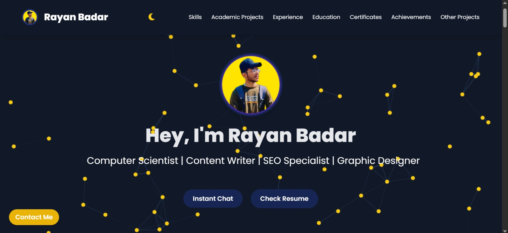

# Rayan Badar — Personal Portfolio Website

Welcome to my **personal portfolio website** — a sleek, responsive, and modern one-page design built using **HTML5**, **Tailwind CSS**, **Alpine.js**, and **Animate.css**. This site showcases my academic background, skills, projects, certifications, and contact details.

<div align="center">
  
</div>

---

## Live Preview

[Click here to view the live site](https://nayar-900.github.io/Portfolio/)  

---

## Tech Stack

- **HTML5** — Semantic, structured, and clean markup
- **Tailwind CSS** — Utility-first CSS framework for styling
- **Alpine.js** — Lightweight JavaScript framework for interactivity
- **Font Awesome** — Icon library used across the UI
- **Google Fonts** — Custom web typography
- **Animate.css** — Smooth and elegant entrance animations
- **Particles.js** — Interactive background effect in hero section

---

## Features

- Fast and responsive design
- Smooth scrolling navigation
- Light/Dark mode toggle (coming soon)
- Interactive project galleries with modals
- Dynamic certificates and achievements modals
- Functional feedback/contact form
- Academic and personal projects with clickable showcases
- Resume download and social media integration

---

## Folder Structure

```

/
├── index.html        # Main website file
├── /images           # All image assets
├── /css (if any)     # Custom styles (optional)
├── favicon.png       # Website tab icon
└── README.md         # This file

````

---

## Sections Included

- **Hero / Intro**
- **About Me**
- **Skills**
- **Academic Projects**
- **Other Projects**
- **Certifications**
- **Achievements**
- **Feedback Form**
- **Contact Me**
- **Footer with Socials**

---

## How to Run Locally

```bash
# Clone the repo
git clone https://github.com/your-username/your-repo-name.git

# Navigate to the folder
cd your-repo-name

# Open index.html in your browser
````

> No build tools required. Just open the file in a browser.

---

## Contact

Feel free to reach out via email or LinkedIn for collaborations or freelance opportunities:

* [rayanbadar900@gmail.com](mailto:rayanbadar900@gmail.com)
* [LinkedIn Profile](https://www.linkedin.com/in/rayan-badar-141ab835a/)

---

## License

This open-source project is available under the [MIT License](LICENSE).

```
